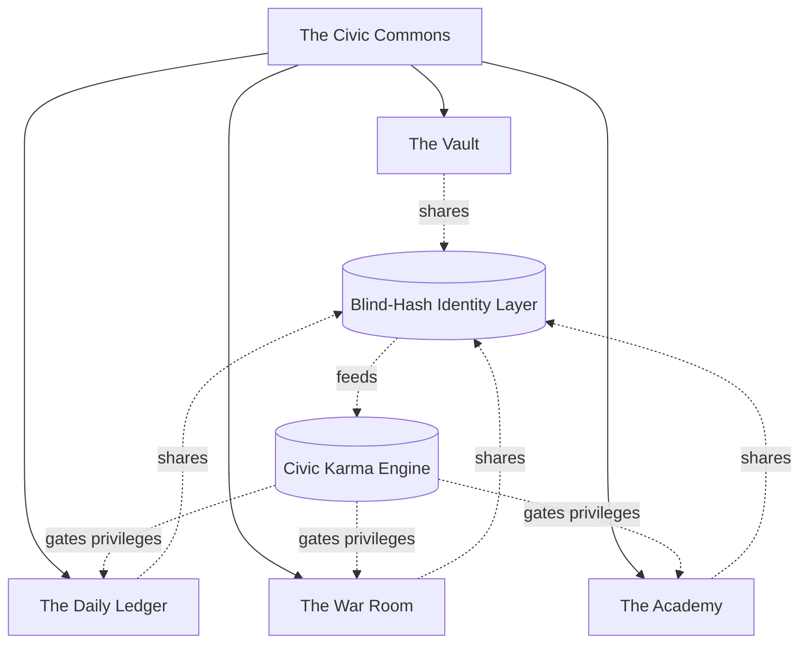
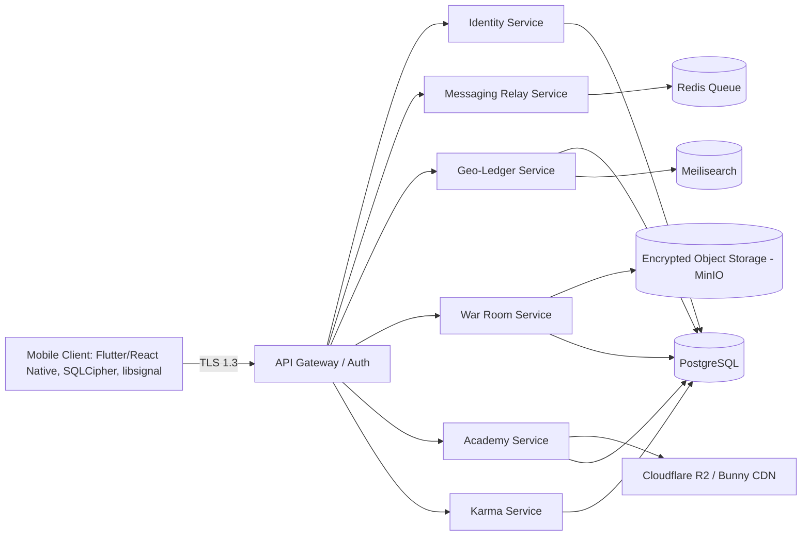
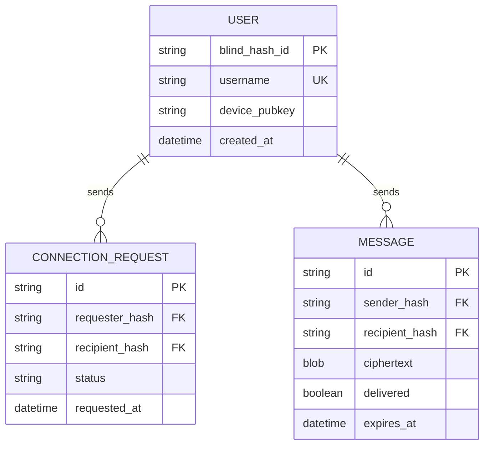
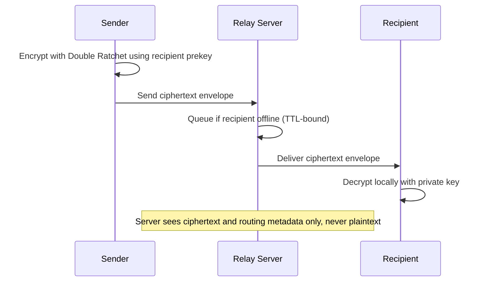
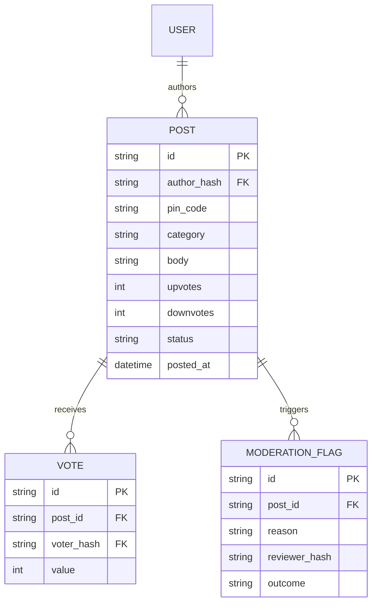
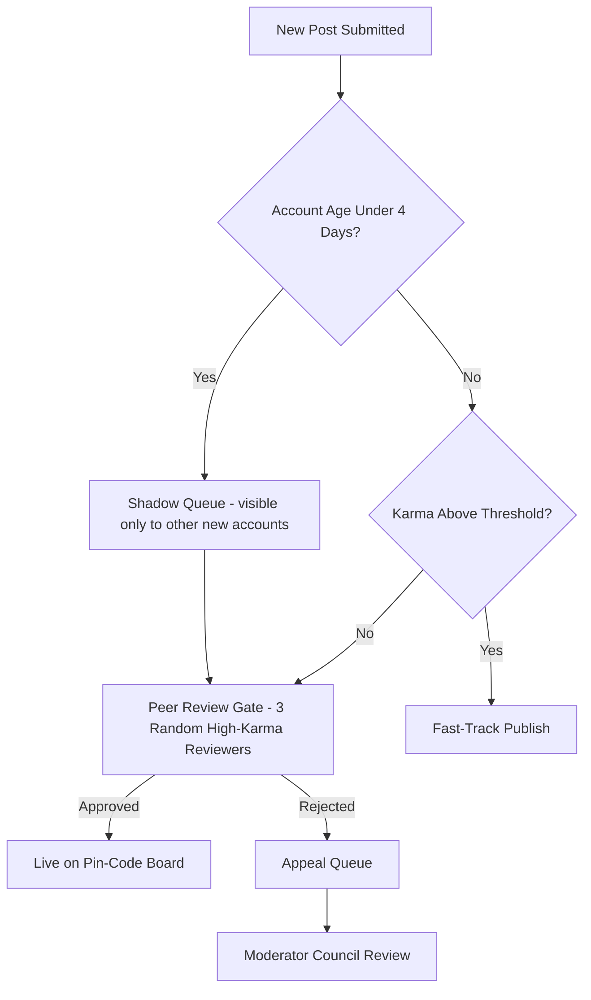
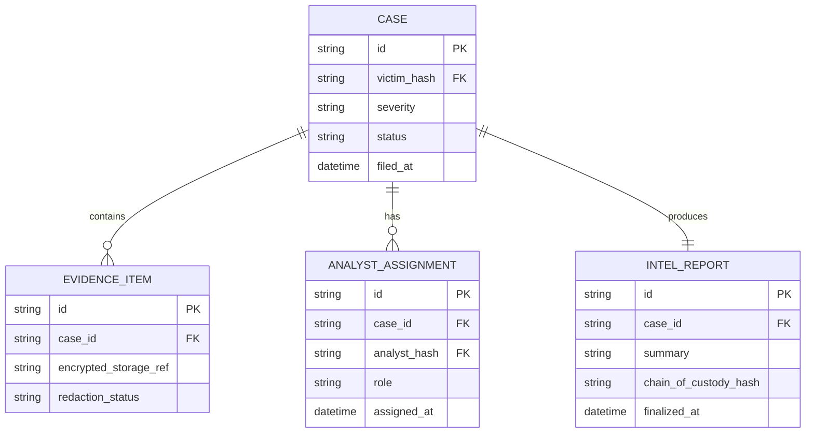
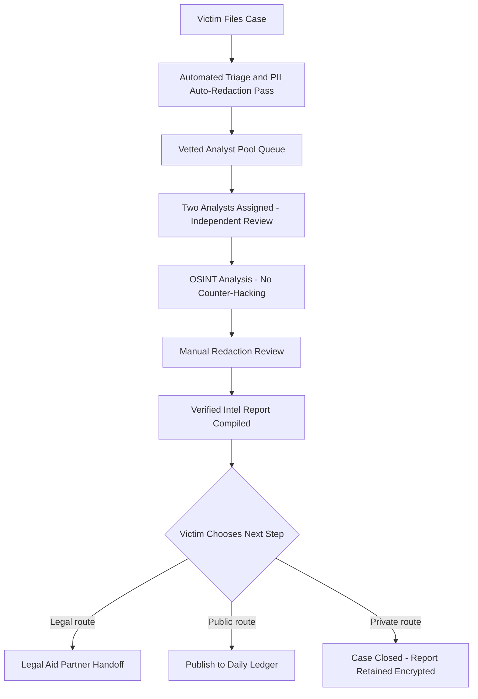
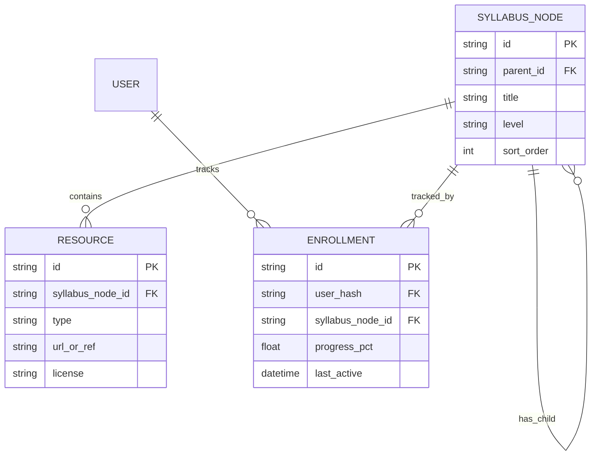

# The Civic Commons
## Product Requirements & System Architecture Document
### A Decentralized Privacy, News, Defense & Education Platform for India's Tier-2/3 Digital Citizens

**Version:** 1.0 (Expanded)
**Status:** Draft for stakeholder review
**Scope note:** This document preserves every feature and decision from the original four-pillar concept brief, and extends it with success metrics, personas, data models, API surfaces, cross-pillar systems, non-functional requirements, and an updated regulatory read — the pieces a build team needs that a vision brief typically doesn't include.

---

## Table of Contents

1. Executive Summary
2. Goals & Success Metrics
3. Target Users & Personas
4. System Architecture Overview
5. Pillar 1 — The Vault (Secure Sovereign Messaging)
6. Pillar 2 — The Daily Ledger (Hyperlocal Civic News)
7. Pillar 3 — The War Room (OSINT Cyber Defense)
8. Pillar 4 — The Academy (Open Education Commons)
9. Cross-Pillar Systems
10. Technical Architecture & Stack
11. Non-Functional Requirements
12. Risk Matrix & Mitigations
13. Regulatory & Compliance Landscape
14. Governance & Financial Sustainability
15. Deployment & Implementation Roadmap
16. Open Questions & Recommended Next Steps
17. Appendix: Glossary

*Sections and content marked (NEW) are additions beyond the original brief. Everything else preserves the source concept, reorganized and specified to build-ready detail.*

---

## 1. Executive Summary

### 1.1 The Problem Space

Three compounding crises define the current digital landscape for Indian citizens, especially outside metro hubs:

**A. Feature Creep & Privacy Degradation.** Mainstream utility tools (WhatsApp and peers) are drifting from pure utilities into data-heavy entertainment hubs — reels, algorithmic feeds, engagement-optimized surfaces — that blur the line between "messenger" and "attention economy" and degrade both user experience and privacy guarantees.

**B. Systemic Injustice & Media Gatekeeping.** Centralized platforms (Reddit, mainstream news) have shallow penetration in Tier-2/Tier-3 towns. Local corruption, political intimidation, and small-scale injustice go unreported because they are easy to suppress through financial pressure or targeted censorship when there is no resilient, hyper-local witness layer.

**C. Scattered Open Education.** High-quality free educational content exists but is fragmented across algorithm-driven platforms. Students lose hours to clickbait and paywalls instead of following a structured, sequential curriculum.

### 1.2 The Solution

A single, self-defending, community-governed civic ecosystem combining:
- Zero-knowledge private messaging that replaces commercial messengers
- A hyperlocal, pin-code-scoped civic news engine
- A crowdsourced OSINT / cyber-defense response unit for victims of digital intimidation
- A structured, paywall-free learning academy

The four pillars share one anonymous identity layer and one reputation system (§9), so trust earned in one part of the app — a verified Ledger report, a closed War Room case — compounds across the whole platform instead of resetting per feature.

### 1.3 Product Principles (NEW)

A compact set of design tenets meant to discipline every feature decision that follows, since a four-pillar app can drift in inconsistent directions without one:

| Principle | What it means in practice |
|---|---|
| Privacy by architecture, not by policy | If a server is compromised or subpoenaed, it should have nothing sensitive to hand over. This is enforced by design — E2EE, blind hashing, local-only keys — not by a privacy-policy promise. |
| Local-first, not platform-first | Every feature should work, in degraded form, on a low-cost Android device with intermittent 2G/3G connectivity in a Tier-3 town. |
| Verification without surveillance | Trust and abuse-resistance (Sybil defense, moderation, analyst vetting) must never require collecting or retaining personally identifying information. |
| Free at the civic core | Messaging, hyperlocal news, cyber-defense intake, and core learning tracks are never paywalled. Monetization sits strictly at the edges (§14). |

---

## 2. Goals & Success Metrics (NEW)

The original brief does not define measurable success criteria. These give the roadmap in §15 something to be held accountable to, and should be instrumented from Phase 1 rather than retrofitted later — several metrics below require event logging designed into the schema from day one.

| Pillar | North-star metric | Supporting metrics |
|---|---|---|
| The Vault | Weekly active end-to-end encrypted conversations | Message delivery success rate; connection-request-to-accept ratio; multi-device pairing adoption |
| The Daily Ledger | Verified civic reports per 10,000 users per pin code | Peer Review Gate approval rate; time-to-publish; misinformation takedown rate |
| The War Room | Median time from case filing to Verified Intel Report | Case backlog size; analyst pool retention; victim-reported satisfaction; legal-aid handoff completion rate |
| The Academy | Module completion rate | Syllabus coverage breadth; Sandbox contribution count; offline-cache usage in low-connectivity districts |
| Platform-wide | 90-day retention of karma-earning users | Cross-pillar usage overlap (e.g., share of Ledger authors who also use the Academy); institutional SaaS clients onboarded |

---

## 3. Target Users & Personas (NEW)

Grounding every feature decision in a concrete "who is this for":

**Priya, 19 — junior-college student, Tier-3 town.** Wants free, structured exam-prep content without ads or clickbait; shares a family Android device with patchy data. → Primary Academy user; needs offline caching and a data-saver mode.

**Arjun, 34 — small shop owner facing extortion over a leaked personal photo.** Needs somewhere safe to report the blackmail, get help identifying the extortionist, and get evidence formatted for a police complaint. → Primary War Room user; needs trauma-aware intake and a fast, trustworthy path to a Verified Intel Report.

**Rekha, 27 — local RTI (Right to Information) activist and citizen journalist.** Documents municipal fund misuse; has been threatened before for posting under her real name. → Primary Ledger + Vault user; needs source protection and credible-but-anonymous publishing.

**Vikram, 24 — CS graduate, volunteer OSINT hobbyist.** Wants to contribute forensic skills to real cases without exposing himself to legal risk or burnout. → Primary War Room analyst; needs a clear vetting path, case-severity triage, and a code of conduct that protects him as much as the victim.

**A district NGO or independent newsroom.** Wants aggregate, anonymized civic-issue trend data across pin codes to prioritize outreach, without ever seeing identifiable user data. → Institutional SaaS client (§14).

---

## 4. System Architecture Overview

### 4.1 The Four-Pillar Model

```
                  ┌────────────────────────────────────────┐
                  │            THE CIVIC COMMONS            │
                  └───────────────────┬────────────────────┘
                                       │
          ┌────────────────────────────┼────────────────────────────┐
          │                            │                            │
  ┌───────▼───────┐            ┌───────▼───────┐            ┌───────▼───────┐
  │   THE VAULT   │            │  THE LEDGER   │            │  THE ACADEMY  │
  │ (Private E2EE │            │ (Hyper-Local  │            │ (Structured   │
  │   Messaging)  │            │  News Board)  │            │Free Education)│
  └───────┬───────┘            └───────┬───────┘            └───────┬───────┘
          │                            │                            │
          └────────────────────────────┼────────────────────────────┘
                                        │
                                ┌───────▼───────┐
                                │ THE WAR ROOM  │
                                │ (OSINT Cyber  │
                                │   Defense)    │
                                └───────────────┘
```

The relationship between pillars, made explicit (NEW):



Two systems are not visible as a "pillar" in the original diagram but are load-bearing for all four: the identity layer and the reputation engine. Both are specified in full in §9.

### 4.2 High-Level Technical Architecture (NEW)



### 4.3 Design Principles

- Zero server-side plaintext for Vault content, ever — the relay only ever holds ciphertext.
- Every service authenticates against the blind-hash identity; none authenticate against a phone number or device identifier.
- Defense in depth: client-side encryption, transport encryption (TLS 1.3), and at-rest encryption (server DB) are independent layers, not substitutes for one another.
- Every pillar degrades gracefully offline (queue-and-sync) rather than hard-failing without connectivity — non-negotiable given the Tier-2/3 target market.

---

## 5. Pillar 1 — The Vault (Secure Sovereign Messaging)

The privacy core of the platform: designed to replace commercial messengers by removing algorithmic tracking and third-party monetization.

### 5.1 Core Features (from source brief)

- **Blind-Hashed Registration.** Users register with a phone number to resist Sybil (mass bot) account creation. The number is immediately passed through a one-way cryptographic hash function; the database retains only the resulting hash, so operators and state actors cannot map an account back to a real-world identity.
- **Username Shielding & the Request Gate.** Phone numbers are never exposed. Interaction requires sharing a custom username. A sender cannot deliver media or see status/presence until the recipient explicitly approves a Connection Request.
- **Zero-Cloud Footprint.** Message databases and cryptographic keys exist solely on the user's device. No communication history is logged on centralized backup servers.

### 5.2 Functional Requirements

| ID | Requirement |
|---|---|
| FR-V1 | Phone numbers are hashed with a salted, slow one-way function (e.g., Argon2id) before persistence; the raw number is discarded immediately after OTP verification and never written to durable storage. |
| FR-V2 | Each account has exactly one shielded username, changeable with a cooldown (e.g., once per 30 days) to limit impersonation churn. |
| FR-V3 | No message, media, typing indicator, or online-status signal reaches a recipient until that recipient has accepted a Connection Request from the sender. |
| FR-V4 | All message content is encrypted client-side using the Signal Protocol (Double Ratchet + X3DH key agreement) before it leaves the device. |
| FR-V5 | Server-side storage of undelivered messages is TTL-bound (e.g., 30 days), ciphertext-only, and purged automatically once delivery is confirmed. |
| FR-V6 | Conversation history is not retrievable from the server after a device is lost; recovery is local-backup-only (see 5.3). |

### 5.3 Recommended Enhancements (NEW)

1. **Duress PIN / decoy vault.** A secondary PIN unlocks a visually identical but empty message store. Under coercion — a forced phone check at a checkpoint, an abusive partner, a corrupt official — the real Vault stays hidden. This is the same hidden-volume pattern used in established disk-encryption tools, applied to a messenger.
2. **Disguised app icon / alias mode.** An optional home-screen icon and app name that mimics a neutral utility (calculator, notes app) for users operating in high-risk environments.
3. **Voluntary client-side abuse reporting.** Since the server cannot read ciphertext, abuse reports must be submitted voluntarily by the recipient, who attaches a locally decrypted copy of the offending message to the report. This mirrors how other E2EE messengers handle abuse reporting without breaking encryption for everyone else.
4. **Secure multi-device pairing via QR, not cloud sync.** A new device is authorized by scanning a QR code from an already-trusted device — never by a cloud-hosted key backup, which would reintroduce a central point of compromise and contradict the zero-cloud-footprint promise.
5. **Offline message queuing.** The client queues outgoing ciphertext locally and retries on reconnect — essential for Tier-3 connectivity patterns, and not mentioned in the source brief.
6. **Encrypted local export/backup.** A user-initiated, password-encrypted export file that the user manually stores (device storage, SD card, personal cloud of their choice) — preserves "no cloud footprint" while giving users a way to not lose history on device loss.

### 5.4 Data Model



### 5.5 Message Flow



### 5.6 Core API Surface

| Endpoint | Method | Purpose |
|---|---|---|
| /v1/identity/register | POST | Submit OTP-verified phone hash proof; create blind-hash ID |
| /v1/identity/username | POST | Claim or update shielded username |
| /v1/identity/keys/{username} | GET | Fetch a recipient's public prekey bundle to start an E2EE session |
| /v1/connections/request | POST | Send a Connection Request |
| /v1/connections/{id}/respond | POST | Accept or reject a Connection Request |
| /v1/messages | POST | Relay a ciphertext envelope |
| /v1/messages/stream | WS | Real-time delivery channel |
| /v1/devices/link | POST | Authorize a new device via QR-exchanged key |

---

## 6. Pillar 2 — The Daily Ledger (Hyperlocal Civic News)

A public-facing, hyper-localized information terminal structured like an objective digital newspaper.

### 6.1 Core Features (from source brief)

- **Geographic Clustering.** Information is segmented strictly by pin code, Assembly constituency, and district, so users see what directly affects their immediate physical neighborhood.
- **Sub-Group Feeds.** Posts divide into structured categories rather than a chaotic timeline: `#CivicInfrastructure` (potholes, water distribution, public fund diversion), `#StudentRights` (exam leaks, institutional bribery, admission scams), `#ConsumerWatch` (local price gouging, corporate malfeasance).
- **The Satire & Culture Hub.** A dedicated space for community memes, political satire, and local civic challenges — keeps engagement vibrant and lowers the psychological barrier to entry through shared cultural expression.

### 6.2 Functional Requirements

| ID | Requirement |
|---|---|
| FR-L1 | Every post is tagged to exactly one pin code and one category at creation. |
| FR-L2 | The default feed view is scoped to the user's registered or selected pin code; cross-pin-code browsing is opt-in ("Explore Nearby"). |
| FR-L3 | New accounts (account age under 96 hours) enter a Shadow Queue rather than publishing directly (see 6.5). |
| FR-L4 | Posts from accounts below a karma-gated trust threshold route through the Peer Review Gate before going live. |
| FR-L5 | Voting weight scales sub-linearly with karma so no small group of high-karma users can dominate consensus on a local issue. |

### 6.3 Recommended Enhancements (NEW)

1. **Civic-notary partnerships.** Cross-reference infrastructure complaints (potholes, water outages) against public municipal open-data or RTI portals where available, auto-attaching a "government record: work order filed / not filed" confidence tag. This turns a bare complaint into a verifiable civic record without needing a human fact-checker on every post.
2. **Vernacular-first UX.** Regional-language UI and voice-to-text posting for lower-literacy or slower-typing users. Given India's linguistic diversity, this is closer to a requirement than a nice-to-have for genuine Tier-2/3 reach.
3. **Transparent moderation log.** Every takedown, edit, or government-request event (with any PII already stripped) is appended to a public, append-only transparency log per pin-code board — reinforces the accountability posture discussed in §13.
4. **Misinformation confidence score.** A lightweight, human-in-the-loop (not fully automated) confidence badge, based on corroborating independent posts and notary cross-references, shown instead of a hard delete for ambiguous claims.
5. **"Explore Nearby" radius control.** Lets users widen their feed beyond one pin code (e.g., to district level) in slower-news areas without losing the hyperlocal default.

### 6.4 Data Model



### 6.5 Moderation Workflow — the Peer Review Gate



### 6.6 Core API Surface

| Endpoint | Method | Purpose |
|---|---|---|
| /v1/posts | POST | Create a post (pin code, category, body) |
| /v1/posts | GET | List posts, filterable by pin code, category, sort order |
| /v1/posts/{id}/vote | POST | Cast or update a vote |
| /v1/posts/{id}/flag | POST | Flag a post for moderation |
| /v1/moderation/queue | GET | Peer Review Gate queue (reviewer role only) |
| /v1/moderation/{flag_id}/decision | POST | Record an approve/reject decision |

---

## 7. Pillar 3 — The War Room (OSINT Cyber Defense)

A specialized intelligence hub providing digital protection to individuals facing blackmail, threats, or institutional intimidation.

### 7.1 Core Features (from source brief)

- **Case Filing Portal.** Victims safely upload evidence of digital extortion or intimidation into an isolated triage area.
- **Crowdsourced Digital Forensics.** Vetted ethical hackers and OSINT analysts collaborate to trace burner accounts, extract image metadata, and analyze malicious email headers — without launching illegal counter-hacks.
- **The Verified Intel Report.** The output of an investigation is a formal, airtight intelligence brief giving victims the empirical leverage to pursue legal recourse, bypass compromised local authorities, or safely surface the evidence on The Daily Ledger.

### 7.2 Functional Requirements

| ID | Requirement |
|---|---|
| FR-W1 | Evidence uploads are encrypted client-side before transit; only the victim and case-scoped-key-holding analysts can decrypt. |
| FR-W2 | Every case receives an automated severity score (e.g., extortion with an imminent deadline ranks above general harassment ranks above an informational request), which drives SLA targets. |
| FR-W3 | A minimum of two independent analysts review each case blind — no cross-visibility of each other's notes until both submit — to reduce single-analyst error or bias. |
| FR-W4 | No case artifact is releasable — to the victim, to the Ledger, or to legal aid — until it passes an automated PII filter and a human redaction review. |
| FR-W5 | Every access to case evidence is chain-of-custody logged (who, when, what action) to preserve evidentiary integrity. |

### 7.3 Recommended Enhancements (NEW)

1. **A CTF-style analyst vetting gauntlet.** Before admission to the real case queue, applicants solve a sandboxed set of synthetic cases — planted metadata, fabricated headers, decoy burner-account trails — that exercise exactly the skills real cases require. This gives a repeatable, auditable competency bar instead of pure trust-based vetting, and doubles as onboarding training.
2. **Tiered severity SLAs.** For example: imminent-threat cases triaged within 2 hours; standard cases within 72 hours. Publishing these targets sets honest expectations for victims.
3. **Legal-aid handoff partnerships.** A pre-negotiated referral pipeline with pro-bono legal aid networks and recognized legal services authorities, so a Verified Intel Report has a concrete next step rather than being a dead-end document.
4. **Trauma-informed intake UX.** Optional voice-note evidence submission for victims who freeze up typing details; a visible "you are in control" consent checkpoint at every stage; a one-tap case-pause or withdraw option.
5. **Analyst code of conduct with an audit trail.** Every analyst action is logged and reviewable by a moderation council; repeated boundary violations (e.g., attempting to identify a victim beyond case scope) trigger automatic suspension — this directly reinforces the source brief's own anti-vigilantism goal.
6. **Burnout safeguards.** Case-load caps per analyst per week and mandatory rotation off high-severity cases — sustained exposure to blackmail and extortion material carries a real psychological cost that a purely volunteer model can't ignore.

### 7.4 Data Model



### 7.5 Case Lifecycle



### 7.6 Core API Surface

| Endpoint | Method | Purpose |
|---|---|---|
| /v1/cases | POST | File a case with encrypted evidence references |
| /v1/cases/{id}/status | GET | Check case status |
| /v1/cases/{id}/findings | POST | Analyst submits findings (analyst role only) |
| /v1/cases/{id}/report/finalize | POST | Finalize the Verified Intel Report |
| /v1/cases/{id}/report | GET | Retrieve the report (victim and authorized parties only) |

---

## 8. Pillar 4 — The Academy (Open Education Commons)

A distraction-free, highly structured learning repository designed to bypass premium educational paywalls.

### 8.1 Core Features (from source brief)

- **The Multi-Tiered Syllabus Tree.** Educational assets are mapped Domain → Category → Sub-Category → Subject → Module, replacing the flat list design of typical media sites.
- **The Video Room.** Custom-uploaded lectures or curated, embedded public-domain YouTube streams, stripped of algorithmic sidebar recommendations and Shorts.
- **The Gutenberg Archive.** An organized library linking to legal, open-access textbooks, PDFs, and official references under Creative Commons licensing.
- **The Sandbox.** A wiki-style text interface where top students and domain experts collaborate via Markdown to write custom study guides, notes, and local academic breakdowns.

### 8.2 Functional Requirements

| ID | Requirement |
|---|---|
| FR-A1 | Video Room embeds strip all recommendation, autoplay, and Shorts surfaces (privacy-enhanced embed mode, curated playlist only). |
| FR-A2 | The Gutenberg Archive never hosts a copyrighted PDF directly — link-out only, with a mandatory license field on every resource. |
| FR-A3 | Sandbox edits are version-controlled: every revision is diffable and revertible, with attributed-but-pseudonymous authorship. |
| FR-A4 | Syllabus nodes are locale-taggable, so the same subject can carry region-specific variants (e.g., state board vs. CBSE). |

### 8.3 Recommended Enhancements (NEW)

1. **Offline-first content caching.** Download-for-offline at the module level — essential for intermittent-connectivity districts — with progress syncing on reconnect.
2. **Cross-pillar study-group matching.** Reuse the Ledger's existing pin-code layer to surface nearby learners on the same syllabus node ("a few people near your pin code are also on Module 4 — form a study group?"). A genuine synergy the source brief doesn't currently exploit.
3. **Skill badges, not credentials.** Lightweight, non-accredited completion badges tied to Civic Karma rather than formal certificates, avoiding any implied institutional accreditation the platform can't back.
4. **Text-to-speech / read-aloud mode.** Accessibility and low-literacy support for Gutenberg Archive text content.
5. **Expert office hours via the Vault.** Verified subject-matter volunteers (gated by karma plus light vetting) hold scheduled Q&A using the Vault's existing E2EE messaging — reuses Pillar 1 infrastructure instead of building a new one.

### 8.4 Data Model



### 8.5 Core API Surface

| Endpoint | Method | Purpose |
|---|---|---|
| /v1/syllabus/tree | GET | Fetch the syllabus tree, filterable by domain/locale |
| /v1/resources/{node_id} | GET | List resources attached to a syllabus node |
| /v1/sandbox/{node_id}/revise | POST | Submit a Markdown revision to a Sandbox page |
| /v1/enrollment/{node_id}/progress | POST | Update progress on a syllabus node |
| /v1/enrollment/me | GET | Fetch the current user's enrollment and progress |

---

## 9. Cross-Pillar Systems (NEW)

The original brief mentions a "Civic Karma" engine once, in the Phase 3 roadmap line, and a "high reputation score" gate once, in a risk mitigation. Both ideas are strong enough to deserve full specification, since every pillar's trust model quietly depends on them.

### 9.1 Unified Identity Layer

One blind-hash ID per person, shared read-only across all four pillars. Each pillar requests only the minimum claim it needs — the Ledger needs pin code and karma; the Vault needs username and device keys; the War Room needs nothing beyond the hash itself. No single service holds a "full profile" of a user; identity is composed at the edges, not centralized.

### 9.2 Civic Karma / Reputation Engine

| Action | Karma | Pillar |
|---|---|---|
| Ledger post confirmed accurate by the Peer Review Gate | +5 | Ledger |
| War Room case contribution on a closed case | +15 | War Room |
| Sandbox note upvoted by 3 or more peers | +3 | Academy |
| Academy module completed | +2 | Academy |
| Successfully vetted as a War Room analyst (one-time) | +20 | War Room |
| Post rejected by the Peer Review Gate | −3 | Ledger |
| Confirmed abuse report against the user | −25 | Cross-pillar |

**Gates:** skip-probation posting (≥50 karma); Peer Review Gate voting rights (≥100); War Room analyst application eligibility (≥150, plus the vetting gauntlet in §7.3); Moderator Council eligibility (≥500 karma plus 90-day tenure).

**Decay:** −2% per month for accounts with no activity, preventing permanent unchecked influence from dormant high-karma accounts.

**Sybil resistance:** karma accrues only to a unique blind-hash ID; daily accrual is rate-limited; anomalous clustering (many new accounts voting in lockstep) dampens vote weight algorithmically rather than banning outright, to avoid false-positive penalties against genuine new local communities. A privacy-preserving proof-of-unique-humanness scheme (in the spirit of social-graph-attestation approaches used elsewhere) is worth evaluating for Phase 4 if simple rate-limiting proves insufficient at scale — flagged here as a direction, not a Phase 1 commitment.

### 9.3 Shared Trust & Safety Infrastructure

The Peer Review Gate (§6.5) is reused by both the Ledger and the Academy Sandbox, and the Moderator Council sits above both. This means one moderation team and one moderation tool investment serves two pillars instead of two independent, duplicated systems.

### 9.4 Notification & Micro-Bounty Engine

Cross-pillar push notifications — a new War Room case matching an analyst's skill tags, a Ledger post in the user's pin code needing review, an Academy study-group match — plus optional micro-bounties (karma, or small monetary rewards if the grant funding in §14.2 supports it) for time-sensitive tasks like urgent case triage. This formalizes what the source brief's Phase 3 roadmap gestures at ("micro-bounties") without specifying.

---

## 10. Technical Architecture & Stack

### 10.1 Stack Table

| Component | Layer | Technology | Justification |
|---|---|---|---|
| Cross-Platform Mobile Client | Front-End | Flutter or React Native | Single codebase, fast deployment across Android and iOS |
| Local Storage Encryption | Client Storage | SQLCipher | Transparent AES-256 encryption at rest on-device |
| Core Encryption Engine | Protocols | Signal Protocol (libsignal) | Double Ratchet E2EE with forward secrecy |
| High-Performance Core Backend | Back-End | Go or Rust | Strong concurrency, low memory footprint |
| Relational & Caching Systems | Databases | PostgreSQL + Redis | PostgreSQL for structured pin-code/asset tables; Redis for fast message routing |
| Video Delivery | Media | YouTube API + Cloudflare R2 & Bunny.net CDN | Hybrid of free content and a low-cost CDN for proprietary tutorials |
| **Search & Discovery** *(NEW)* | Data | Meilisearch or OpenSearch, self-hosted | Full-text and geo search across Ledger posts and the Academy syllabus, without exporting data to a third-party search API |
| **API Gateway / Auth** *(NEW)* | Back-End | Kong or Envoy, token issuance keyed to the blind-hash ID | A single choke point for rate limiting, auth, and abuse detection without centralizing content |
| **Object Storage** *(NEW)* | Storage | MinIO (self-hosted, S3-compatible) | Encrypted evidence and media blobs for the War Room and Vault attachments, kept in-region |
| **Observability** *(NEW)* | Ops | Prometheus + Grafana, structured logs scrubbed of PII at source | Operational visibility without ever logging plaintext user content |

### 10.2 Service Boundary Summary

| Service | Owns | Never touches |
|---|---|---|
| Identity Service | Blind-hash ID issuance, username registry, device key registry | Raw phone numbers (discarded post-verification) |
| Messaging Relay Service | Ciphertext routing, TTL-bound queuing | Message plaintext, under any circumstance |
| Geo-Ledger Service | Posts, votes, moderation flags, pin-code indexing | Vault or War Room data |
| War Room Service | Case intake, analyst assignment, redaction pipeline, chain-of-custody log | Ledger publishing decisions |
| Academy Service | Syllabus tree, resources, Sandbox revisions, enrollment | Any messaging or case content |
| Karma Service | Reputation events and scores, gate checks | Content itself — only references content IDs and outcomes |

### 10.3 Infrastructure Diagram

See §4.2 for the consolidated client-to-service-to-datastore diagram.

### 10.4 Data Residency

Given the sensitivity of War Room evidence in particular, host primary infrastructure in-region (India) from day one rather than retrofitting data localization later — this also simplifies the DPDP Act compliance posture discussed in §13.2.

---

## 11. Non-Functional Requirements (NEW)

| Category | Requirement |
|---|---|
| Security | Independent penetration test before each major release; public bug-bounty program once out of beta; hardware-backed key custody for the very few keys ever held server-side |
| Scalability | Design for regional sharding by state or pin-code cluster from the outset, to avoid a single-region hot spot during a viral local event |
| Availability | War Room intake targets 99.9% uptime — this is the pillar where downtime carries the highest real-world cost |
| Performance | Message delivery at P95 under 2 seconds on 3G; Ledger feed load at P95 under 1.5 seconds |
| Accessibility | WCAG 2.1 AA minimum; voice input and output on War Room intake and Academy content |
| Localization | Hindi plus at least three additional major regional languages at MVP; no hardcoded English strings in the client |
| Offline tolerance | Vault queues outgoing messages offline; Academy supports module-level offline caching; Ledger supports offline draft composition with sync-on-reconnect |
| Data residency | Primary data stores hosted in-region (India) from Phase 1 |

---

## 12. Risk Matrix & Mitigations

### 12.1 Original Risks (preserved, mitigations expanded)

**1. Legal Pressures & Traceability Laws.**
*Threat:* Indian IT guidelines require platforms to be able to identify the "first originator" of a message under specific legal warrants.
*Mitigation:* Zero-knowledge architecture that never holds decryption keys on centralized servers establishes technical inability — data that does not exist on the infrastructure cannot be compelled. **This needs a 2026 update; see §13.1 — the mitigation is necessary but no longer sufficient on its own.**

**2. Algorithmic Misinformation & "IT Cell" Manipulation.**
*Threat:* Paid actors or coordinated political operations could hijack local pin-code boards to spread deepfakes, false reporting, or coordinated character assassination.
*Mitigation:* A structured onboarding probation period (new profiles cannot post or upvote for their first few days) plus metadata-based validation and an internal Peer Review Gate staffed by high-reputation community members. Directly implemented by the Shadow Queue and karma gates in §6.5 and §9.2.

**3. Vigilantism & Accidental Doxing.**
*Threat:* Overzealous crowdsourced investigators in the War Room could accidentally expose the wrong individual, causing real-world harm.
*Mitigation:* Programmatic text and image filters; no case folder goes public or reaches the general analyst pool until it is systematically scrubbed of unverified home addresses, private numbers, and unblurred faces of private citizens. Directly implemented by FR-W4 and the analyst code of conduct in §7.3.

**4. Copyright Challenges in Education.**
*Threat:* Users may inadvertently upload pirated PDF editions of proprietary academic literature, exposing the platform to liability.
*Mitigation:* The repository blocks direct user-to-server PDF sharing for textbooks; users contribute via the Sandbox's Markdown text canvas or by curating direct links to authorized Open Educational Resources. Directly implemented by FR-A2.

### 12.2 Additional Risks (NEW)

**5. Full platform block under Section 69A of the IT Act.**
*Threat:* Recent precedent (see §13.1) shows Indian courts will uphold a full nationwide block of a messaging platform specifically because its architecture prevents targeted enforcement — the same zero-knowledge design this platform depends on for privacy.
*Mitigation:* Treat proactive fraud and misuse prevention as core safety infrastructure rather than an afterthought, since platform misuse — not the encryption debate itself — is what has actually triggered blocking orders in practice. Maintain direct-APK sideload and F-Droid distribution from day one so a Play Store or App Store action does not fully cut off access. Build a rapid-response legal and communications protocol for government notices, since regulators have shown they can act within days.

**6. Volunteer/analyst burnout and vetting failure.**
*Threat:* The War Room depends on unpaid expert labor; both burnout and a single bad-actor analyst are existential risks to platform trust.
*Mitigation:* Caseload caps, mandatory rotation off high-severity cases, the CTF-style vetting gauntlet, and a fully audited action log (§7.3).

**7. Funding sustainability risk.**
*Threat:* A privacy-first, ad-tech-free positioning narrows the available funding base relative to a conventional app.
*Mitigation:* Diversify across freemium tiers, hyperlocal advertising, institutional SaaS, and philanthropic or digital-rights grant funding (§14.2) rather than depending on a single stream.

---

## 13. Regulatory & Compliance Landscape (NEW)

*This is not legal advice. Validate this section with India-qualified counsel before launch (Phase 0, §15). This is a fast-moving area — treat what follows as a snapshot as of July 2026, not a permanent baseline.*

### 13.1 Traceability and the "Technical Inability" Strategy — an Update the Source Brief Needs

The source brief's core legal mitigation for Risk 1 — build zero-knowledge architecture so there is nothing to hand over — remains sound as a way to protect individual users' data from disclosure. But the legal environment around it has moved in a direction the original framing does not account for:

- The foundational fight is the multi-year challenge by Meta/WhatsApp to Rule 4(2) of the IT (Intermediary Guidelines) Rules, 2021, in the Delhi High Court, arguing traceability is incompatible with end-to-end encryption and violates the right to privacy recognized in the 2017 Puttaswamy judgment. That case set the terms of the debate without resolving it.
- More consequentially: in June 2026, the Delhi High Court upheld a full nationwide block of Telegram under Section 69A of the IT Act, after criminal networks used it to run exam-fraud schemes tied to the NEET-UG 2026 medical entrance exam. The ruling held that Section 69A permits blocking an entire platform when a court accepts that its architecture makes targeted, message-level enforcement structurally impossible — a full block rather than a narrower originator-tracing order.
- As of this week, India's Ministry of Electronics and IT has frozen WhatsApp's global username rollout in the country and opened review notices to Telegram and Signal, citing the same pseudonymous-identifier-plus-encryption architecture that the Telegram ruling turned on.

**Implication for this platform:** "you cannot be compelled to hand over what you never held" is still true and still worth building, but it is no longer a complete shield. The live risk today is a Section 69A-style full block, not merely a failed disclosure order. This argues for two things the source brief does not mention: treating misuse prevention (fraud, exam leaks, coordinated harassment — precisely the failure modes that triggered the Telegram block) as core safety infrastructure rather than a moderation nice-to-have, since misuse is what regulators have actually acted on; and building resilient distribution (§12, risk 5) from day one rather than as a contingency plan.

### 13.2 The DPDP Act, 2023 — Timeline and What It Means for This Roadmap

India's Digital Personal Data Protection Act was enacted in 2023. Its implementing Rules were finalized in November 2025 and are rolling out in three phases: the Data Protection Board of India has been operational since November 2025; the Consent Manager framework activates in November 2026; and full substantive compliance — notice and consent design, breach reporting, data-principal rights such as access, correction, deletion, and grievance redressal, and children's data protections — becomes mandatory from May 13, 2027, with penalties for serious violations reaching into the hundreds of crores of rupees.

Two consequences specific to this project:

- **Timeline alignment.** The roadmap in §15 puts public launch roughly a year out, landing close to the window where full DPDP enforcement begins. Build the compliance surface — consent capture at OTP and registration, a grievance-redressal flow, breach-notification tooling — into Phase 1 architecture rather than retrofitting it in Phase 4.
- **A structural head start, with one gap to close.** DPDP obligations scale with how much personal data an entity actually holds, and the Vault's blind-hashing and zero-cloud-footprint design (§5) already minimizes collection to almost nothing — a genuine advantage over data-heavy competitors. But the platform still briefly touches a raw phone number before hashing it, and that moment needs a compliant consent notice and a documented retention/deletion policy; a breach of even hashed identifiers likely still triggers a notification obligation under the Rules' broad reporting standard.
- **Children's data.** DPDP imposes verifiable-parental-consent requirements for processing a child's data. Since the Academy will realistically attract under-18 students (see the Priya persona, §3), this needs explicit age-handling in the product rather than an assumption that all users are adults — add this to the NFRs in §11 for Phase 1 scoping.

---

## 14. Governance & Financial Sustainability

### 14.1 Governance Model (NEW)

- **Entity structure.** Consider a Section 8 nonprofit (India's public-interest company structure) rather than a pure for-profit, given the civic-infrastructure positioning — this reinforces trust and eases partnership with NGOs and legal aid organizations.
- **Community Governance Council.** Seats partly elected from high-karma users (tenure and karma threshold per §9.2), partly reserved for partner organizations (legal aid, digital rights groups). Reviews moderation appeals, transparency reports, and major policy changes.
- **Public transparency dashboard.** Uptime, aggregate and PII-free moderation statistics, and a running log of government data requests received and the platform's response — a warrant-canary-style accountability mechanism that reinforces the technical-inability posture from §13.1 with visible follow-through.

### 14.2 Financial Sustainability

**1. Freemium Utility Tiers** *(preserved)*. Core features — private chat, local news, cyber safety, and learning tracks — stay completely free. Premium subscriptions fund advanced customization, multi-device sync, and private secure cloud backups for local data.

**2. Contextual, Localized Marketplaces** *(preserved)*. Small, neighborhood-level storefronts pay a fixed fee to pin a promotional banner inside their relevant local pin-code news board — geography-based, with no cookie collection or cross-site identity tracking.

**3. Institutional SaaS Integrations** *(preserved, with a safeguard added)*. Independent media, non-profits, and public research institutes pay a subscription rate for analytics tools, structured leak-ingest frameworks, and anonymized trend feeds. **Privacy safeguard (NEW):** this stream must draw only from the Ledger's already-public post metadata and aggregate Academy completion stats, gated by a k-anonymity minimum cohort size (for example, no trend surfaced from fewer than 20 underlying users). Vault and War Room data must be architecturally walled off from this product — the Vault already has zero server-side visibility, and War Room case data should be excluded by explicit policy, not just convention, given how sensitive it is.

**4. Philanthropic / digital-rights grant funding** *(NEW)*. Organizations with a track record of funding privacy and civic-tech infrastructure are a natural fit for underwriting the War Room specifically, since that pillar should not be monetized at the point of a victim's worst day.

---

## 15. Deployment & Implementation Roadmap

**Phase 0 — Foundation (Pre-Month 1)** *(NEW)*
- Legal review of the traceability and DPDP posture with India-qualified counsel (§13)
- Nonprofit or public-interest entity registration (§14.1)
- External cryptographic architecture review of the libsignal integration plan before any code ships

**Phase 1 — The Inception (Months 1–4)** *(preserved)*
- Open-source codebase release (GitHub)
- Blind-hash verification system and user-ID creation mechanics
- MVP: secure one-on-one E2EE messenger and document vault

**Phase 2 — The Agora (Months 5–8)** *(preserved)*
- Geographic parsing engine (pin-code tracking and sub-groups)
- Public news ledger integration and content voting mechanics
- Satire, meme, and hyperlocal community interaction hubs

**Phase 3 — The Defense & Academy (Months 9–12)** *(preserved)*
- The OSINT War Room core (anonymized triage portal)
- The Academy blueprint (syllabus tree and YouTube curation infrastructure)
- Civic Karma reputation engine deployment and micro-bounties

**Phase 4 — Scale & Harden (Months 13–18)** *(NEW)*
- Regional sharding rollout and additional vernacular languages
- Public bug-bounty program launch
- Institutional SaaS product goes live with differential-privacy safeguards in place
- First external transparency report published

**Resourcing note** *(NEW)*: a lean cross-functional team — 2–3 backend engineers, 1–2 mobile engineers, one security/crypto specialist, one community/trust-and-safety lead, one product lead — could credibly execute Phases 0–2. Phase 3's War Room specifically needs its trust-and-safety lead and legal-aid partnerships in place *before* opening case intake, not after.

---

## 16. Open Questions & Recommended Next Steps (NEW)

Framed with a recommended default and what would change it, rather than left as open TBDs:

1. **Legal entity jurisdiction.** Recommend Indian nonprofit registration given the target market; revisit only if the Phase 0 legal review (§13) surfaces a strong reason to incorporate a core protocol foundation abroad while keeping India operations local.
2. **Initial launch geography.** Recommend piloting in 2–3 Tier-2/3 districts with an engaged NGO or legal-aid partner already in place, rather than a national launch, so War Room case volume stays inside what the initial vetted analyst pool can actually serve.
3. **Analyst compensation.** Recommend starting fully volunteer- and karma-based, per the source brief, but revisit by Phase 4 if analyst burnout (§12, risk 6) shows up in retention data — a stipend or bounty model funded via the grant stream in §14.2 is the natural next step.
4. **Branding and naming.** "The Civic Commons" is a working title used throughout this document. Alternatives worth testing with early users: *Setu* (bridge), *Nagrik* (citizen), *Suraksha Grid*.

---

## 17. Appendix: Glossary

- **Blind-Hash ID** — a one-way cryptographic hash of a phone number; the only identity artifact ever stored.
- **Civic Karma** — the cross-pillar reputation score gating posting, voting, and analyst privileges.
- **Peer Review Gate** — the community-jury content review queue shared by the Ledger and the Academy Sandbox.
- **Shadow Queue** — the probationary visibility state applied to new accounts' posts.
- **Verified Intel Report** — the formal, redacted output of a closed War Room case.
- **Chain of Custody Log** — the immutable access log for War Room evidence, preserving evidentiary integrity.
- **Connection Request** — the Vault's opt-in gate that must be accepted before a sender can reach a recipient with media or presence signals.

