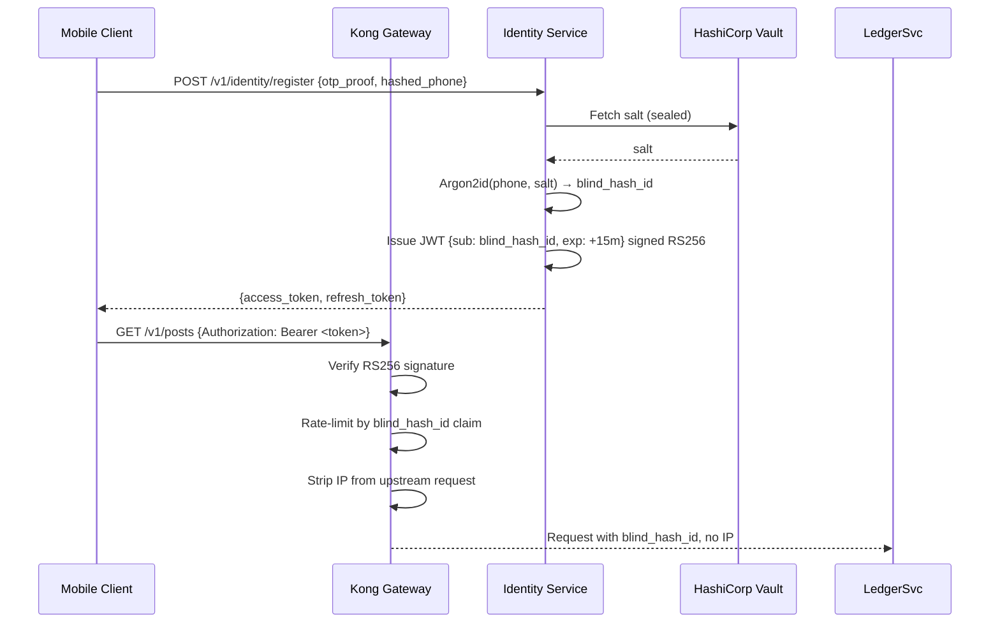

# The Civic Commons — Technical Stack Specification
## Implementation-Grade Architecture Reference

**Companion document to:** Civic_Commons_PRD.md v1.0
**PRD correlation policy:** Every major decision in this document cites the PRD section that motivates it. Where a technology is chosen over a named alternative, the reason is explicit.
**Status:** Phase 0 / Phase 1 build reference

---

## Table of Contents

1. Stack Philosophy
2. Layer Map
3. Client Layer — Mobile Application
4. Cryptography & Security Layer
5. API Gateway & Transport
6. Backend Services
7. Data Layer
8. Event Bus & Async Messaging
9. Media & Content Delivery
10. Search & Discovery
11. Observability & Operations
12. Infrastructure & Deployment
13. CI/CD & Release Pipeline
14. Compliance Engineering Surface
15. Technology Decision Log
16. Phase-to-Stack Mapping

---

## 1. Stack Philosophy

Derived directly from PRD §1.3 (Product Principles):

| PRD Principle | Engineering Translation |
|---|---|
| **Privacy by architecture, not by policy** | Zero plaintext on any server. No telemetry without explicit opt-in. All secrets resolved at runtime from a secrets manager, never baked into images or config files. |
| **Local-first, not platform-first** | Offline-capable client. All network calls are queued and retried. The app renders from local cache before any server response arrives. Target: usable on a ₹6,000 Android device over 2G. |
| **Verification without surveillance** | Identity is a blind hash. Auth tokens are short-lived, not tied to device fingerprints. Rate limiting by hashed ID, never by IP or device identifier. |
| **Free at the civic core** | No third-party analytics SDK in the free tier. No ad networks. Revenue instruments (§14 PRD) run in isolated code paths that cannot touch Vault or War Room data. |

---

## 2. Layer Map

```
┌─────────────────────────────────────────────────────────────────────┐
│                        CLIENT LAYER                                  │
│  Flutter 3.x (Dart)  •  SQLCipher  •  libsignal-protocol-dart       │
│  Hive (local KV)  •  WorkManager (bg sync)  •  flutter_secure_storage│
└─────────────────────────────┬───────────────────────────────────────┘
                               │ TLS 1.3 / mTLS (War Room channel)
┌─────────────────────────────▼───────────────────────────────────────┐
│                     API GATEWAY LAYER                                │
│  Kong OSS 3.x  •  JWT RS256  •  Rate Limiting  •  Request Logging    │
│  (PII-scrubbed at this boundary — never logged raw)                  │
└───────┬───────────┬──────────┬──────────┬──────────┬────────────────┘
        │           │          │          │          │
┌───────▼───┐ ┌─────▼──┐ ┌────▼───┐ ┌────▼───┐ ┌────▼───┐
│ Identity  │ │Messaging│ │Geo-    │ │War     │ │Academy │
│ Service   │ │ Relay   │ │Ledger  │ │Room    │ │Service │
│  (Go)     │ │ (Go)    │ │Service │ │Service │ │(Go)    │
│           │ │         │ │ (Go)   │ │ (Go)   │ │        │
└───────────┘ └─────────┘ └────────┘ └────────┘ └────────┘
        │           │          │          │          │
        └─────┬─────┘          └────┬─────┘          │
              │                     │                 │
┌─────────────▼─────────────────────▼─────────────────▼──────────────┐
│                        DATA LAYER                                    │
│  PostgreSQL 16 (PostGIS, pgcrypto)  •  Redis 7 (Streams + Cache)    │
│  Meilisearch 1.x  •  MinIO (S3-compat, SSE-C)                       │
└─────────────────────────────────────────────────────────────────────┘
        │
┌───────▼─────────────────────────────────────────────────────────────┐
│                     EVENT BUS                                        │
│  NATS JetStream  (durable, at-least-once, exactly-once opt-in)       │
└─────────────────────────────────────────────────────────────────────┘
        │
┌───────▼─────────────────────────────────────────────────────────────┐
│                  OBSERVABILITY & SECRETS                             │
│  Prometheus + Grafana + Loki + Tempo (LGTM stack)                   │
│  HashiCorp Vault (secrets management)  •  Falco (runtime security)  │
└─────────────────────────────────────────────────────────────────────┘
        │
┌───────▼─────────────────────────────────────────────────────────────┐
│                   INFRASTRUCTURE LAYER                               │
│  Kubernetes 1.29+  •  Helm 3  •  ArgoCD  •  Terraform               │
│  Hetzner Cloud (eu-central, in-region India planned Phase 2)        │
│  Cloudflare (CDN, DDoS, R2 object storage)  •  Bunny.net (video)    │
└─────────────────────────────────────────────────────────────────────┘
```

---

## 3. Client Layer — Mobile Application

### 3.1 Framework Choice: Flutter 3.x (Dart)

**Decision:** Flutter over React Native.

React Native was listed as an alternative in PRD §10.1. The tiebreaker is vernacular rendering. Flutter uses Impeller (its own GPU rendering engine) and handles complex multi-script text shaping — Devanagari, Tamil, Telugu, Bengali, Malayalam — natively with `flutter_localizations` and the `google_fonts` package without relying on the native platform's text renderer. React Native delegates to the OS text engine, creating inconsistent rendering across Android versions, particularly on cheaper devices (PRD NFR: WCAG 2.1 AA, Hindi + 3 regional languages at MVP, §11).

| Criterion | Flutter | React Native |
|---|---|---|
| Multi-script text shaping | Impeller — consistent across all Android | OS text engine — inconsistent on older Android |
| SQLCipher integration | `sqflite_sqlcipher` — first-class | Available, larger bridge overhead |
| libsignal binding | `libsignal_protocol_dart` (maintained fork) | JS bridge adds latency on encryption calls |
| Offline-first patterns | Hive + WorkManager — well-documented path | AsyncStorage has reliability issues on low-RAM devices |
| APK size (bare) | ~7 MB release APK | ~12 MB minimum |
| Cold-start time (budget Android) | ~600 ms (Impeller AOT) | ~1200 ms (JS bridge init) |

### 3.2 Client Dependencies (Pinned)

| Package | Version | Purpose | PRD Reference |
|---|---|---|---|
| `libsignal_protocol_dart` | 0.4.x | Signal Protocol / Double Ratchet | §5, FR-V4 |
| `sqflite_sqlcipher` | 3.x | AES-256 encrypted local DB | §5, FR-V1, FR-V6 |
| `flutter_secure_storage` | 9.x | KeyStore/Keychain key material | §5 §9.1 |
| `hive_flutter` | 2.x | Lightweight offline KV (non-crypto data) | §11 Offline tolerance |
| `workmanager` | 0.5.x | Background message queue retry | §11, FR-V5 |
| `geolocator` / `geocoding` | latest | Pin-code resolution | §6, FR-L2 |
| `flutter_localizations` | SDK | i18n scaffolding | §11 Localization |
| `google_fonts` | 6.x | Mukta + Noto Sans multi-script | Design file §3 |
| `just_audio` | 0.9.x | Voice-note War Room intake | §7.3 enhancement 4 |
| `record` | 5.x | Voice-note capture | §7.3 enhancement 4 |
| `image_gallery_saver` | 2.x | Save Verified Intel Report locally | §7 |
| `connectivity_plus` | 5.x | Network state detection for offline UI | §11 |
| `flutter_dotenv` | 5.x | Env vars (never bundle API keys) | §1.3 |

### 3.3 Local Storage Architecture

Three isolated storage scopes on-device:

```
Device Storage
├── SQLCipher DB (vault.db)
│   ├── conversations (ciphertext blobs)
│   ├── connection_requests
│   └── message_queue (outgoing, encrypted)
├── Hive boxes
│   ├── ledger_drafts (offline compose cache)
│   ├── academy_progress (module completion, offline)
│   └── karma_cache (score, last updated)
├── Secure Enclave / Android Keystore
│   ├── identity_private_key (Ed25519, non-exportable)
│   ├── signal_identity_key_pair
│   └── duress_pin_salt
└── App Cache
    ├── academy_offline_modules/
    └── ledger_thumbnail_cache/
```

**Key derivation chain (Vault):**
```
User PIN (4-6 digit)
    → Argon2id (memory=64MB, iterations=3, parallelism=4)
    → 256-bit derived key
    → SQLCipher database key (per-database, not stored on device raw)
```

**Duress PIN** (PRD §5.3, enhancement 1): Two separate Argon2id derivation paths from two different PINs produce two different database keys. The "real" key opens `vault.db`; the "duress" key opens `vault_decoy.db`. To the device OS, both are valid encrypted databases. The user registers both PINs at setup; the app never stores which is which.

### 3.4 Offline Architecture

Every network call goes through a `NetworkRepository` layer that:
1. Reads from local cache and returns it immediately (optimistic render)
2. Queues the real request in a `PendingOperation` table in SQLCipher
3. `WorkManager` retries the queue on network availability, exponential backoff (1s, 2s, 4s ... 5 min max)
4. On success, patches the local cache and emits a `DataSyncEvent` to the UI layer via `BLoC`

State enum exposed to UI: `{LIVE, CACHED, QUEUED, OFFLINE}` — shown non-intrusively in the app shell (Design file §9).

---

## 4. Cryptography & Security Layer

This section specifies every cryptographic primitive in use. The goal is to leave nothing to "implementation will decide later," because cryptographic decisions made under pressure tend to be wrong.

### 4.1 Transport Security

| Layer | Specification |
|---|---|
| All client-to-server traffic | TLS 1.3 only. TLS 1.2 disabled server-side. |
| Certificate pinning | Public key pinning on the 3 API gateway certificates, with a 3-certificate rotation window. Implemented via `http_certificate_pinning` package. |
| War Room evidence upload channel | Mutual TLS (mTLS): client presents a short-lived certificate issued by the Karma Service upon analyst vetting. |
| HSTS | `max-age=31536000; includeSubDomains; preload` |

### 4.2 Vault Encryption — Signal Protocol Implementation

```
Key Exchange (session establishment):
  X3DH (Extended Triple Diffie-Hellman)
  → Identity keys: Ed25519 (signing), Curve25519 (DH)
  → Signed prekey: Curve25519, rotated every 7 days
  → One-time prekeys: Curve25519, 100-key batch, refilled when < 20 remain
  → Key agreement output: 32-byte shared secret via HKDF-SHA256

Session encryption (ongoing):
  Double Ratchet Algorithm
  → Diffie-Hellman ratchet: Curve25519
  → Symmetric ratchet: HKDF-SHA256 chain keys
  → Message encryption: AES-256-CBC + HMAC-SHA256
  → Message keys: discarded after decryption (forward secrecy)

Key storage:
  All private keys: Android Keystore (hardware-backed where available)
                    iOS Secure Enclave
  Public key bundle: PostgreSQL (Identity Service, unencrypted — public by design)
  Session state: SQLCipher DB (vault.db)
```

### 4.3 Identity Hashing — Phone Number

**Algorithm:** Argon2id

```
argon2id(
  password = raw_phone_number_E164,
  salt = platform_secret_32_bytes,  // rotated quarterly, stored in HashiCorp Vault
  memory = 65536 KB,
  iterations = 3,
  parallelism = 4,
  hash_length = 32 bytes
)
→ hex-encoded 64-char string stored as blind_hash_id
```

**Why Argon2id over bcrypt/scrypt:** Argon2id wins the Password Hashing Competition and provides memory-hardness against GPU/ASIC rainbow-table attacks. For a phone number space of ~1.4 billion Indian numbers, a rainbow table attack is theoretically plausible with bcrypt; Argon2id raises the cost to infeasible at these parameters.

**The salt is a secret.** It is stored exclusively in HashiCorp Vault, fetched by the Identity Service at startup into a sealed Go `sync.Once` — never written to disk, never logged.

### 4.4 War Room Evidence Encryption

Evidence upload is a multi-key encryption scheme:

```
Step 1 (client-side, before upload):
  Generate random 256-bit Data Encryption Key (DEK)
  Encrypt evidence blob: AES-256-GCM (DEK, random nonce)
  Encrypted blob → MinIO (keyed by case_id + evidence_id)

Step 2 (key wrapping):
  Wrap DEK with victim's public key (ECIES / X25519)
  Wrap DEK with each assigned analyst's public key (same)
  Wrapped keys → PostgreSQL (war_room.evidence_keys table)

Step 3 (analyst decryption):
  Analyst fetches their wrapped DEK → unwraps with their private key
  Fetches encrypted blob from MinIO → decrypts locally
  Evidence never decrypts server-side
```

**MinIO server-side encryption:** SSE-C (customer-provided keys) with per-object keys managed by HashiCorp Vault. Bucket-level encryption provides defense-in-depth if object-level keys are somehow compromised.

### 4.5 Password / PIN Handling (User Auth)

App PIN (unlocks local DB — see §3.3):
- Argon2id as specified above
- PIN never sent to server
- Failed attempt counter in secure storage; after 10 fails, wipe SQLCipher DB

Session tokens (API auth):
- Short-lived JWTs: RS256, 15-minute access tokens
- Refresh tokens: opaque 256-bit random strings, stored in Keystore/Secure Enclave
- Token rotation on every refresh
- Server-side refresh token revocation list in Redis (TTL 30 days)

### 4.6 Security Threat Model (condensed)

| Threat | Mitigation |
|---|---|
| Server compromise / subpoena | No plaintext content; no raw phone numbers; Vault keys never leave client |
| Sybil attacks (bot farms) | Phone-number-bound blind hash; daily karma accrual rate limit; lockstep-vote dampening |
| Insider threat (engineer with DB access) | All PII columns encrypt-at-rest via pgcrypto; query audit log via Falco; principle of least privilege via Postgres row-level security |
| Rainbow-table attack on blind_hash_id | Argon2id + per-deployment secret salt (§4.3) |
| War Room evidence leakage | Multi-key AES-GCM client-side, server stores only ciphertext + wrapped keys |
| Account takeover (stolen device) | Local PIN wipe after 10 fails; Duress vault; remote session revocation |
| Traffic analysis (metadata) | WebSocket connection always open while app is foreground; dummy "heartbeat" traffic to obscure messaging patterns (opt-in, data-saver mode disables it) |

---

## 5. API Gateway & Transport

### 5.1 Kong OSS 3.x

**Choice over Envoy/Nginx:** Kong's plugin ecosystem makes per-route policy composition in YAML/declarative config — rate limiting, JWT validation, request transformation, logging — without custom Lua for each. This matters for a small team. Envoy is more powerful but requires more operational engineering.

**Active plugins:**

| Plugin | Config | PRD Motivation |
|---|---|---|
| `jwt` | RS256, HS256 disabled | §4.2, §9.1 identity |
| `rate-limiting-advanced` | Per `blind_hash_id` (claim from JWT), not IP | §4.6 Sybil defense |
| `request-transformer` | Strip `X-Forwarded-For` before upstream | Prevent IP leakage to services |
| `response-transformer` | Remove server version headers | Surface reduction |
| `prometheus` | Expose `/metrics` per route | §11 Observability |
| `bot-detection` | Block known crawler User-Agents at gateway | Spam resistance |
| `correlation-id` | Inject trace ID into every request | Distributed tracing |

**PII scrub at the boundary:** The access log transformer plugin strips phone numbers, usernames, and IP addresses from every log line before they reach Loki. Raw logs are never written — only structured, scrubbed log events.

### 5.2 Authentication Flow



### 5.3 WebSocket — Vault Message Relay

- Protocol: WebSocket over TLS 1.3 (`wss://`)
- Authentication: JWT in the first WebSocket message frame (not URL query param — query params are logged)
- Message framing: Protocol Buffers (binary, compact) over WebSocket frames
- Heartbeat: server-sent ping every 25 s; client must pong within 10 s
- Reconnect: exponential backoff on client, jitter ±20%

---

## 6. Backend Services

### 6.1 Language Choice: Go 1.22+

All six services are written in Go. The PRD listed "Go or Rust" (§10.1). Go is the choice for Phase 1–3 because:
- Faster time-to-working-code for a small team
- First-class `net/http`, `goroutine`-based concurrency is sufficient for these workloads
- `go-sqlcipher` and native Postgres drivers are mature
- Hiring for Go in India's tech market is straightforward; Rust is still niche

Rust is re-evaluated at Phase 4 if profiling identifies hot paths where Go's GC pause is measurable at scale. It is not worth the onboarding cost in early phases.

### 6.2 Service Breakdown

#### Identity Service

```go
// Responsibilities:
// - OTP verification (via Twilio Verify or MSG91)
// - Argon2id phone → blind_hash_id
// - Username claim/release with cooldown
// - Device public-key registration
// - JWT issuance (RS256, 15 min)
// - Refresh token management

// Key dependencies:
// - PostgreSQL: users, usernames, devices, refresh_tokens tables
// - Redis: OTP codes (TTL 10 min), refresh token revocation list
// - HashiCorp Vault: Argon2id salt, RS256 private signing key

// Critical constraints:
// - Raw phone number IN MEMORY maximum 500ms (OTP verify → hash → discard)
// - Never persisted to disk, DB, or log at any point
// - Audit log entry: {event: "registration", hash_id: "...", timestamp: "..."} — no phone
```

#### Messaging Relay Service

```go
// Responsibilities:
// - WebSocket connection management (millions of concurrent conns via goroutines)
// - Ciphertext envelope routing (sender hash → recipient hash)
// - Offline queue (Redis Streams, TTL 30 days)
// - Multi-device fan-out (one sender → multiple recipient devices)
// - Delivery acknowledgement + queue purge
// - Connection Request state machine

// Key dependencies:
// - Redis Streams: message queue per blind_hash_id
// - PostgreSQL: connection_requests table only
// - NATS JetStream: publishes karma events when Connection Request accepted

// Critical constraints:
// - Service processes ciphertext envelopes only
// - Message body is opaque bytes[] — no deserialization, no inspection
// - Logs: {event: "delivered", msg_id: "<uuid>", latency_ms: 45} — zero content
```

#### Geo-Ledger Service

```go
// Responsibilities:
// - Post CRUD with pin-code + category tagging
// - Geographic indexing (PostGIS point-in-polygon for constituency lookup)
// - Vote recording with karma-weighted sub-linear scoring
// - Shadow Queue management (new account posts)
// - Peer Review Gate assignment (3 random reviewers, weighted by karma)
// - Moderation flag intake
// - Publish → NATS for karma events

// Key dependencies:
// - PostgreSQL + PostGIS: posts, votes, moderation_flags, pin_codes geometry
// - Meilisearch: full-text index of post titles/bodies (sync via NATS subscriber)
// - Redis: vote count cache (sync to PG on batch flush every 60s)
// - NATS JetStream: karma event publisher

// Geographic resolution:
// POST body includes: {pin_code: "400001"}
// Service validates pin_code against PostGIS pin_codes table
// Auto-resolves to {district, state, assembly_constituency} via ST_Within query
```

#### War Room Service

```go
// Responsibilities:
// - Encrypted case intake (evidence blobs via presigned MinIO URLs)
// - Automated severity scoring (rules-based v1, ML v2 roadmap)
// - Analyst assignment (two independent, skill-tag matched from eligible pool)
// - Blind review enforcement (analysts cannot see each other's notes until both submit)
// - Automated PII filter (regex + NLP pass on text evidence before analyst view)
// - Chain-of-custody logging (append-only, immutable, PostgreSQL WAL-based)
// - Verified Intel Report compilation + HMAC signing
// - Legal-aid handoff API (partner webhook)

// Key dependencies:
// - PostgreSQL: cases, evidence_items, analyst_assignments, intel_reports, custody_log
// - MinIO: encrypted evidence blob storage (SSE-C)
// - HashiCorp Vault: DEK wrapping key material
// - NATS: karma event publisher (case closed → analyst karma++)
// - Redis: analyst active-case-count cap enforcement

// Severity scoring rules (v1):
// Keywords in intake form: ["blackmail", "sextortion", "deadline", "24 hours"] → CRITICAL
// Keywords: ["threats", "stalking", "doxxing"] → HIGH
// Keywords: ["harassment", "fake profile"] → MEDIUM
// Default: LOW
// Human override always possible after triage
```

#### Academy Service

```go
// Responsibilities:
// - Syllabus tree CRUD (admin + vetted contributor roles)
// - Resource CRUD (link-out only for PDFs, license field required)
// - Sandbox Markdown version control (diff + revert)
// - Enrollment + progress tracking
// - Offline cache manifest generation (list of module assets to prefetch)
// - Video Room embed URL generation (YouTube privacy-enhanced mode)

// Key dependencies:
// - PostgreSQL: syllabus_nodes, resources, sandbox_revisions, enrollments
// - Cloudflare R2: proprietary video storage
// - Bunny.net: video delivery CDN
// - Meilisearch: syllabus full-text search

// YouTube embed config (privacy-enhanced mode):
// Base: https://www.youtube-nocookie.com/embed/{video_id}
// Params: rel=0&modestbranding=1&controls=1&fs=1
// No: autoplay, sidebar recommendations, Shorts links
```

#### Karma Service

```go
// Responsibilities:
// - Consume karma events from NATS (all services publish events, Karma Service owns scores)
// - Compute and store karma scores per blind_hash_id
// - Gate checks: isEligibleForX(hash_id) → bool (used by other services)
// - Monthly decay job (-2% for inactive accounts)
// - Anomaly detection: lockstep-vote clustering → vote weight dampening flag
// - Karma event ledger (append-only, auditable)

// Key dependencies:
// - PostgreSQL: karma_scores, karma_events (append-only)
// - Redis: karma score cache (TTL 5 min, warm invalidation on event)
// - NATS JetStream: subscriber on karma.* topic

// Gate check API (used inter-service, not exposed via public gateway):
// GET /internal/karma/{hash_id}/gate/{gate_name}
// → {eligible: bool, current_score: int, threshold: int}
```

### 6.3 Inter-Service Communication

All six services communicate through one of three channels:

| Channel | Used for | Technology |
|---|---|---|
| Synchronous request/response | User-facing API calls that need an immediate answer | HTTP/2 over internal cluster DNS |
| Async events (fire-and-forget) | Karma events, Meilisearch sync, moderation outcomes | NATS JetStream |
| Internal gate checks | Karma eligibility queries between services | HTTP/2 internal (not exposed via Kong) |

No service calls another service's database directly. Each service owns its own tables; cross-cutting reads go through the owning service's API.

---

## 7. Data Layer

### 7.1 PostgreSQL 16

**Extensions loaded:**
- `postgis` — pin-code polygon storage and constituency resolution (§6, FR-L1, FR-L2)
- `pgcrypto` — at-rest column encryption for any column that might contain quasi-identifiers
- `pg_stat_statements` — query performance monitoring
- `uuid-ossp` — UUID v4 primary keys across all tables

**Row-level security (RLS):** Enabled on `war_room.cases`, `war_room.evidence_items`. Service connects with a restricted role (`warroom_rls_role`) that can only see rows where the `blind_hash_id` matches the authenticated session claim. No "select *" queries possible at the DB level without RLS bypass, which requires the `warroom_admin` role (two-person authorization required to grant).

**Replication:** Streaming replication to two standbys (synchronous commit to at least one). Patroni for automatic failover. Point-in-time recovery (PITR) with WAL archiving to encrypted MinIO bucket.

**Sharding strategy (Phase 4):** Pin-code prefix-based logical sharding. Posts, votes, and Ledger queries naturally cluster by geography. Citus extension evaluated at Phase 4 if single-node PostgreSQL shows saturation.

### 7.2 Redis 7

**Deployment:** Redis Sentinel (3-node: 1 primary, 2 replicas, 3 sentinels). Redis Cluster deferred to Phase 4.

**Key namespaces:**

| Namespace | Contents | TTL |
|---|---|---|
| `otp:{hashed_phone}` | OTP code (bcrypt-hashed) | 10 min |
| `refresh:{token_hash}` | Refresh token → blind_hash_id mapping | 30 days |
| `revoked:{token_hash}` | Revoked refresh tokens | 30 days |
| `msg_queue:{blind_hash_id}` | Undelivered message stream (Redis Streams) | 30 days per message |
| `karma:{blind_hash_id}` | Cached karma score | 5 min |
| `vote_buffer:{post_id}` | Vote count accumulator (flushed to PG every 60s) | No TTL |
| `analyst_load:{blind_hash_id}` | Active case count per analyst (cap enforcement) | Session-based |
| `rate:{blind_hash_id}:{endpoint}` | Rate limit counter | 1 min |

### 7.3 Meilisearch 1.x

Self-hosted, not Meilisearch Cloud — data never leaves the infrastructure. Two indexes:

**`ledger_posts`:**
```json
{
  "primaryKey": "post_id",
  "searchableAttributes": ["title", "body"],
  "filterableAttributes": ["pin_code", "district", "category", "status"],
  "sortableAttributes": ["posted_at", "vote_score"],
  "rankingRules": ["words", "typo", "proximity", "attribute", "sort", "exactness"]
}
```

**`academy_nodes`:**
```json
{
  "primaryKey": "node_id",
  "searchableAttributes": ["title", "description"],
  "filterableAttributes": ["domain", "locale", "level"],
  "rankingRules": ["words", "typo", "proximity", "attribute", "sort", "exactness"]
}
```

Meilisearch receives updates via a NATS JetStream subscriber (`meilisearch-sync` sidecar), not direct DB writes, so the Ledger and Academy services don't know Meilisearch exists.

### 7.4 MinIO

**Deployment:** MinIO distributed mode, 4 nodes, 2 drives each (erasure-coded, tolerates 2 node failures).

**Buckets:**

| Bucket | Contents | Encryption | Retention |
|---|---|---|---|
| `vault-attachments` | Encrypted Vault media attachments | SSE-C (client key) | TTL 30 days unless saved locally |
| `warroom-evidence` | Encrypted War Room evidence blobs | SSE-C (per-object DEK via HashiCorp Vault) | Until case disposition + 7 years (legal) |
| `academy-media` | Proprietary lecture video | SSE-S3 (MinIO-managed) | Indefinite |
| `wal-archive` | PostgreSQL WAL for PITR | SSE-S3 | 30 days |

**Access:** No public bucket access. All access via presigned URLs (15-minute expiry) generated server-side by the owning service. Analysts never get a direct MinIO URL — the War Room Service fetches, decrypts locally in-service, then streams to the analyst client over the mTLS channel.

---

## 8. Event Bus — NATS JetStream

NATS JetStream provides durable, at-least-once pub/sub between services. It replaces direct service-to-service HTTP calls for events that are fire-and-forget and must survive restarts.

**Topic schema:**

```
karma.events.ledger.post_approved       → {hash_id, post_id, delta: +5}
karma.events.ledger.post_rejected       → {hash_id, post_id, delta: -3}
karma.events.warroom.case_closed        → {hash_id, case_id, delta: +15}
karma.events.academy.module_complete    → {hash_id, node_id, delta: +2}
karma.events.platform.abuse_confirmed   → {hash_id, delta: -25}
karma.events.connection.request_accepted → {hash_id} (triggers cross-pillar intro flow)
search.sync.ledger.post_published       → {post_id, title, body, pin_code, ...}
search.sync.ledger.post_deleted         → {post_id}
search.sync.academy.node_updated        → {node_id, title, description, ...}
notifications.push                      → {target_hash_id, type, payload}
```

**Delivery guarantees:** At-least-once for karma events (Karma Service is idempotent — duplicate events detected by `event_id` in `karma_events` table). At-most-once acceptable for search sync (full re-index recovers from missing events).

---

## 9. Media & Content Delivery

### 9.1 Academy Video Delivery

```
Upload path:
  Admin uploads lecture video
  → API → Academy Service → presigned MinIO URL → video uploaded
  → NATS event → Transcoding Worker (FFmpeg, Kubernetes Job)
  → Outputs: 360p, 480p, 720p HLS segments
  → Segments pushed to Cloudflare R2 (primary) + Bunny.net (fallback)

Playback path:
  Client requests video
  → Academy Service checks enrollment
  → Returns signed Bunny.net stream URL (30-min expiry)
  → Client plays via HLS.js / flutter_hls_parser
  → Bitrate auto-adapts to network conditions (ABR)

Data-saver mode (Priya persona, PRD §3):
  Force 360p, disable autoplay, cache first 60s before full download
```

### 9.2 Offline Module Caching

The Academy Service generates a `module_manifest.json` per syllabus node at publish time:
```json
{
  "node_id": "...",
  "resources": [
    {"type": "video", "hls_manifest": "...", "size_mb": 45, "duration_sec": 1800},
    {"type": "sandbox_page", "content_hash": "...", "size_kb": 12}
  ],
  "total_size_mb": 57
}
```
The client downloads this manifest and presents the user with a storage-cost warning before caching. WorkManager handles background download in segments. Cached content is stored in the app's external storage partition (user can move to SD card).

---

## 10. Search & Discovery

### 10.1 Geo-Search — Daily Ledger

Pin-code feed queries go directly to PostgreSQL (PostGIS `ST_Within` query against the `pin_codes` geometry table). This is fast for the expected query pattern (feed load for one pin code = 20–50 posts, indexed by `(pin_code, status, posted_at)`).

Full-text search (keyword search within the Ledger) hits Meilisearch, which filters by pin code and category.

### 10.2 Syllabus Search — Academy

Meilisearch `academy_nodes` index, filtered by `locale` and `domain`. Suggests nodes as the user types (instant-search, 50ms target).

### 10.3 No AI Recommendation Engine

The platform deliberately has no algorithmic feed, no collaborative filtering, no "you might also like." The Ledger is chronological-within-pin-code. The Academy is tree-navigated by the user's own curriculum choice. This is a product decision (PRD §1.1 problem B — algorithmic suppression is part of what the platform is built against) and an engineering simplification.

---

## 11. Observability & Operations

### 11.1 The LGTM Stack (Grafana Labs OSS)

Self-hosted entirely:

| Tool | Role |
|---|---|
| **Prometheus** | Metrics scraping (Kong + all services expose `/metrics`) |
| **Grafana** | Dashboards + alerting |
| **Loki** | Log aggregation (structured JSON logs, PII-scrubbed at source) |
| **Tempo** | Distributed tracing (OpenTelemetry spans, trace ID injected by Kong) |

**PII scrub policy for logs:**
Every service uses a structured logging library (`zap` for Go) with a custom `zapcore` encoder that:
- Redacts any string matching `E164` phone pattern
- Redacts any string matching the `blind_hash_id` pattern in non-audit contexts
- Never logs JWT claims other than `sub` (blind_hash_id)
- Never logs request bodies for Vault or War Room routes

### 11.2 Key Dashboards

| Dashboard | Key signals |
|---|---|
| Vault Health | Message delivery P95 latency, offline queue depth, WebSocket conn count |
| Ledger Quality | Posts/hour, Peer Review Gate queue depth, misinformation flag rate |
| War Room SLA | Cases open > 2h (critical), cases open > 72h (standard), analyst load distribution |
| Academy Engagement | Active enrollments, module completion rate, offline cache hit ratio |
| Karma Engine | Events per minute, score distribution histogram, anomaly flags |
| Security | Failed auth rate, rate-limit hit rate, Falco alert count |

### 11.3 Runtime Security — Falco

Falco rules deployed on every Kubernetes node:
- Alert if any War Room pod attempts to write plaintext evidence to logs
- Alert if any pod opens an unexpected outbound connection (data exfiltration indicator)
- Alert if Identity Service pod touches any column other than `blind_hash_id`, `username`, `device_pubkey`
- Alert if Prometheus or Loki scrapes a response containing a string matching `E164` phone pattern

---

## 12. Infrastructure & Deployment

### 12.1 Kubernetes

**Version:** 1.29+ (LTS track)
**Deployment:** Managed Kubernetes (Hetzner Kubernetes Engine for Phase 1 due to cost; migrate to local Indian cloud provider — Yotta, NxtGen, or MeghRaj — for Phase 2 to satisfy DPDP Act data-residency requirement (PRD §13.2))

**Namespaces:**

| Namespace | Contains |
|---|---|
| `civic-core` | All 6 backend services |
| `civic-data` | PostgreSQL (StatefulSet), Redis Sentinel, MinIO |
| `civic-infra` | Kong, NATS JetStream, HashiCorp Vault |
| `civic-search` | Meilisearch |
| `civic-obs` | Prometheus, Grafana, Loki, Tempo |
| `civic-jobs` | Transcoding workers, karma decay cron, Meilisearch sync |

### 12.2 Secrets Management — HashiCorp Vault

All secrets resolved at runtime, never stored in Kubernetes Secrets (which are base64, not encrypted by default):

```
vault/civic-commons/
├── identity/
│   ├── argon2_salt               # 32 bytes, rotated quarterly
│   ├── jwt_rs256_private_key     # Rotated annually
│   └── otp_provider_api_key
├── warroom/
│   ├── minio_root_credentials
│   └── legal_aid_webhook_secret
├── db/
│   ├── postgres_password
│   └── redis_password
└── services/
    └── {service_name}/db_password # Vault dynamic secrets (auto-rotated)
```

Services use **Vault Agent sidecar** injection — secrets mounted as files at pod start, refreshed automatically. No env vars with secrets. No hardcoded values.

### 12.3 Helm Charts

One Helm chart per service. Chart values per environment (`values-staging.yaml`, `values-production.yaml`). Chart templates enforce:
- Non-root container user
- Read-only root filesystem
- `securityContext.allowPrivilegeEscalation: false`
- Resource requests/limits defined (prevents OOM cascade)
- PodDisruptionBudget defined (ensures zero-downtime rolling deployments)

### 12.4 Terraform

Infrastructure-as-code for:
- Kubernetes cluster provisioning
- MinIO cluster provisioning
- PostgreSQL backups bucket
- DNS records
- Cloudflare R2 bucket + WAF rules

No manual ClickOps. Every infra change requires a `terraform plan` review in CI before `terraform apply`.

---

## 13. CI/CD & Release Pipeline

### 13.1 GitHub Actions Pipeline

```
Triggered by: PR merge to main (or tagged release for mobile)

Stage 1 — Quality Gate:
  ├── Go: golangci-lint (50+ linters), go vet
  ├── Flutter: flutter analyze, dart format --set-exit-if-changed
  ├── Security: gosec (Go SAST), gitleaks (secret detection)
  └── Dependencies: nancy (Go), dependabot (Flutter)

Stage 2 — Tests:
  ├── Unit tests (all services): go test ./... -race -coverprofile
  ├── Flutter unit + widget tests
  ├── Integration tests: Docker Compose brings up service + dependencies
  └── Coverage gate: 80% minimum per service

Stage 3 — Build:
  ├── Docker: multi-stage builds, scratch/distroless base
  ├── Flutter: APK (Android) + IPA (iOS) release builds
  └── Image scan: Trivy (CRITICAL/HIGH CVEs block merge)

Stage 4 — Deploy (Staging):
  ├── ArgoCD sync to staging cluster
  ├── Smoke tests (k6 load test, 30s, 100 VUs)
  └── Notify Slack: deploy success / failure

Stage 5 — Deploy (Production):
  ├── Manual approval gate (2 team members)
  ├── ArgoCD progressive rollout (10% → 50% → 100%, 5 min intervals)
  └── Automatic rollback on >1% error rate increase
```

### 13.2 Mobile Releases

- **Android:** GitHub Actions → signed APK/AAB → Google Play Internal Testing → F-Droid (direct APK, for sideload resilience per PRD §12.2 Risk 5)
- **iOS:** GitHub Actions → Xcode Cloud → TestFlight → App Store

F-Droid publishing is a first-class release channel, not an afterthought — it ensures the app remains accessible even if Google Play removes it under government pressure.

---

## 14. Compliance Engineering Surface

### 14.1 DPDP Act 2023 — Technical Obligations

Full compliance required by May 13, 2027 (PRD §13.2). Engineering work that must ship in Phase 1:

| DPDP Obligation | Engineering Implementation | Status |
|---|---|---|
| Itemized consent notice at registration | Flutter onboarding screen with explicit consent checkpoint before OTP call | Phase 1 |
| Purpose-bound data use | Service boundary enforcement (§6.2 each service "Never touches" column) | By design |
| Breach notification within 72h | Falco alert → PagerDuty → automated breach report draft | Phase 1 |
| Data Principal rights (access/correct/delete) | `/v1/identity/me` (GET), `/v1/identity/me` (PATCH), `/v1/identity/me` (DELETE → cascade wipe) | Phase 1 |
| Grievance redressal | In-app grievance form → Karma Service ticketing → 30-day resolution SLA | Phase 2 |
| Children's data (< 18) | Age declaration at registration; if < 18, parental consent flow (Phase 2) | Phase 2 |
| Breach reporting to DPBI | Automated report generation from Falco + Grafana alert payload | Phase 1 |

### 14.2 IT Rules 2021 — Traceability Defense

As discussed in PRD §13.1, the "technical inability" defense is correct but incomplete post-Telegram ruling. Engineering additions:

- **Misuse reporting API:** A dedicated `POST /v1/reports/platform-misuse` endpoint that routes to a separate queue, human-reviewed within 24h, designed to allow platform to proactively respond to government concerns without breaking E2EE.
- **Emergency contact escalation (War Room):** CRITICAL-severity cases with imminent physical danger have a dedicated escalation path to CERT-In (Indian Computer Emergency Response Team) — a pre-registered contact, not a backdoor.
- **Transparency log API:** Public `GET /v1/transparency/government-requests` — append-only log of notices received and outcomes. Updated within 72h of each notice.

---

## 15. Technology Decision Log

A record of key decisions made and alternatives rejected, so future engineers understand the reasoning.

| Decision | Choice | Rejected | Key reason |
|---|---|---|---|
| Mobile framework | Flutter | React Native | Multi-script text rendering, libsignal binding latency |
| Backend language | Go | Rust, Node.js, Python | Team velocity vs. performance tradeoff at this team size |
| API gateway | Kong OSS | Envoy, AWS API GW | Plugin composability; no cloud vendor lock-in |
| Event bus | NATS JetStream | Kafka, RabbitMQ | Operational simplicity; Kafka overkill at Phase 1 volume |
| Search | Meilisearch | Elasticsearch, Algolia | Self-hosted (data sovereignty); simpler ops than ES |
| Object storage | MinIO | AWS S3, GCS | In-region, data sovereignty, SSE-C support |
| Secrets management | HashiCorp Vault | Kubernetes Secrets, AWS Secrets Manager | Vendor-agnostic; dynamic secret rotation; no cloud lock |
| Container runtime | containerd | Docker, CRI-O | Standard Kubernetes; Docker daemon unnecessary overhead |
| Log aggregation | Loki | Elasticsearch, Splunk | Native Grafana integration; cost at scale; self-hosted |
| Identity hash | Argon2id | bcrypt, scrypt, PBKDF2 | Password Hashing Competition winner; memory-hardness |
| Signal Protocol | libsignal-protocol-dart | Matrix/Olm, custom | Proven E2EE standard; audited; forward secrecy by design |
| DB | PostgreSQL | MySQL, CockroachDB, MongoDB | PostGIS for geo; mature RLS; pgcrypto; strongest FOSS ecosystem |

---

## 16. Phase-to-Stack Mapping

| Component | Phase 0 | Phase 1 | Phase 2 | Phase 3 | Phase 4 |
|---|---|---|---|---|---|
| Flutter client (Vault MVP) | Design | Build | Extend | Extend | Harden |
| Identity Service | Design | Build | — | — | Harden |
| Messaging Relay | Design | Build | — | — | Harden |
| Geo-Ledger Service | — | Design | Build | Extend | Scale |
| War Room Service | — | — | Design | Build | Scale |
| Academy Service | — | Design | Build | Extend | Scale |
| Karma Service | Design | Build stub | Full build | Extend | Scale |
| NATS JetStream | Setup | Configure | Extend | Extend | Scale |
| PostgreSQL + PostGIS | Setup | Configure | Migrate | Migrate | Shard |
| Meilisearch | — | — | Deploy | Extend | Scale |
| MinIO | Setup | Vault buckets | Evidence bucket | — | Scale |
| HashiCorp Vault | Setup | Full | — | — | — |
| Kong OSS | Setup | Full | — | — | — |
| LGTM Observability | Setup | Core dashboards | War Room SLA dash | Full | — |
| ArgoCD + Terraform | Setup | Full | — | — | — |
| Indian cloud region | — | — | Migrate | — | — |
| F-Droid release channel | — | Build | — | — | — |
| Bug bounty program | — | — | — | — | Launch |
| DPDP compliance surface | Design | Core consent+delete | Grievance flow | Children age-gate | Full audit |
